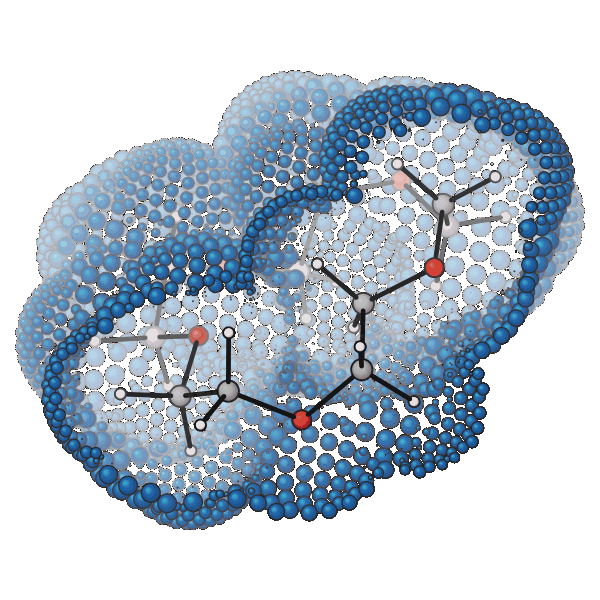

👋 **Hi, I'm Lukas!**

I'm a passionate theoretical scientist pursuing my PhD, developing theories and algorithms to capture the complex physical nature of chemistry.

I actively contribute to ORCA and various open-source projects, developing in Fortran, C++, and sometimes Python, with an emphasis on quantum chemistry methods and statistical mechanics-based approaches.

Currently, my research focuses on implicit solvation. My most recent work is on a smooth and fully differentiable molecular cavity (SvdW-DROP). The animation on the right shows the projection step (Discretization via Reference-Onto-surface Projection) for 15-Crown-5: the blue reference van der Waals surface is projected onto the a smooth implicit surface (red). Read the preprint <a href="https://chemrxiv.org/doi/full/10.26434/chemrxiv.15003893/v2">here</a><.

  
  &nbsp;
  
  &nbsp;
  
  &nbsp;
  

